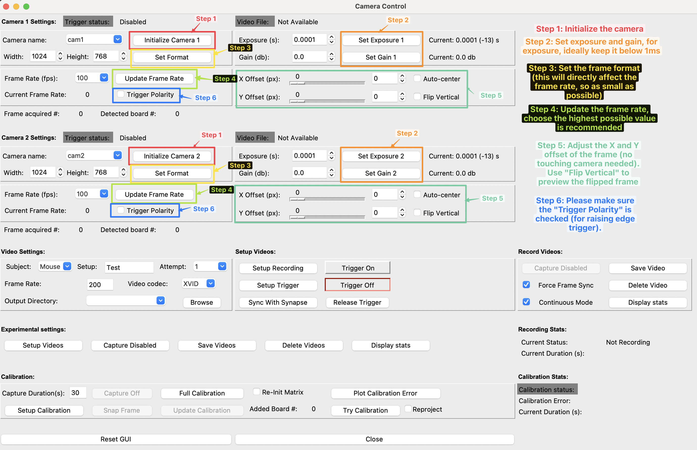
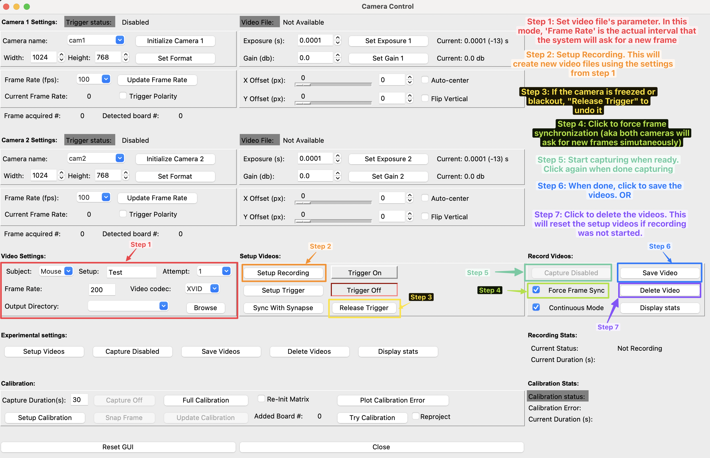
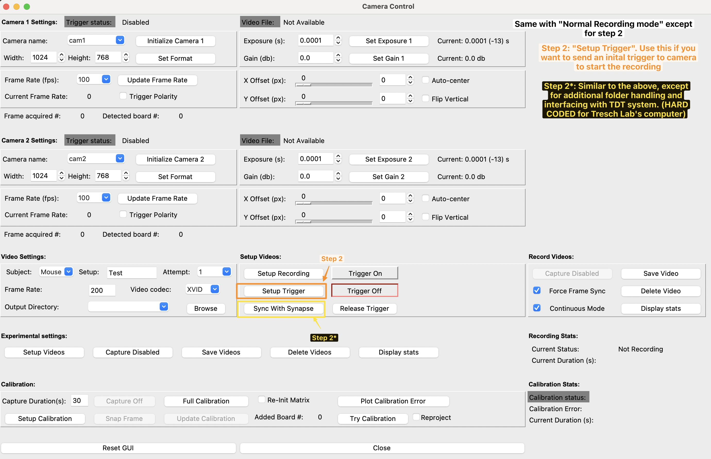
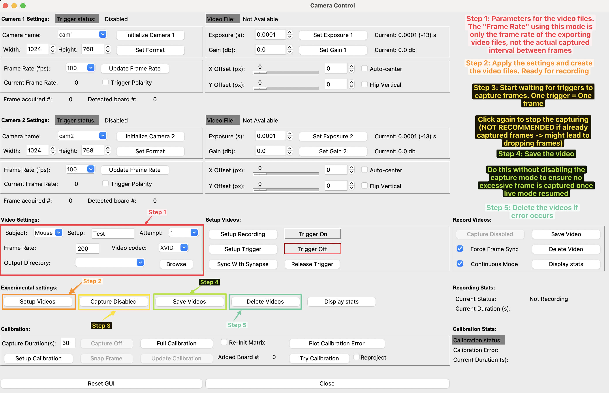
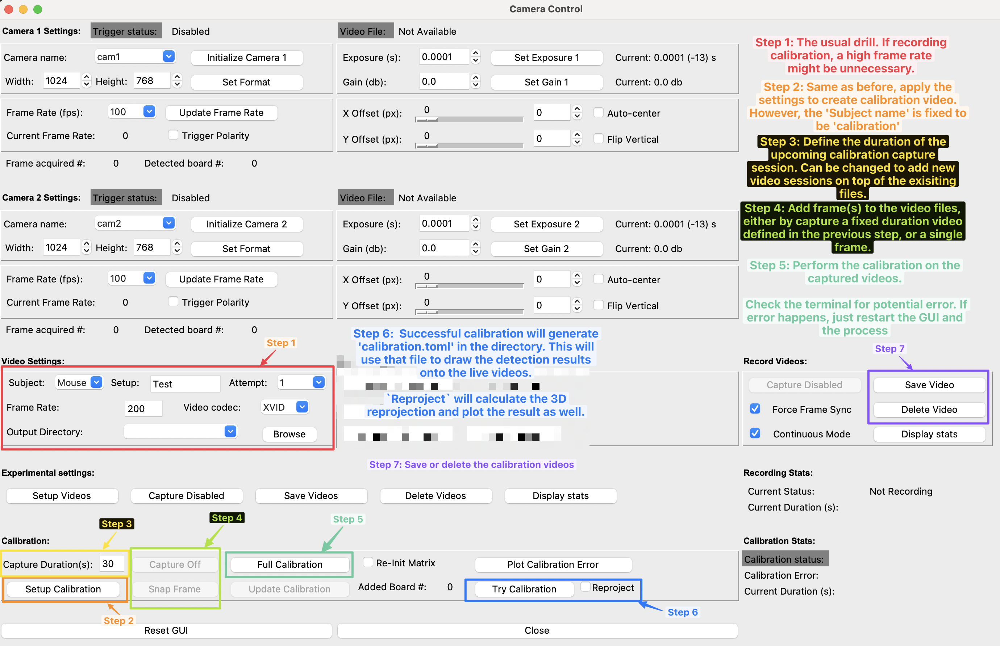

# Info
## Usage cases
### 0. General camera control

### 1. Normal recording mode (non-trigger)

### 2. Trigger-per-session recording mode

### 3. Trigger-per-frame recording mode

### 4. Calibration mode
